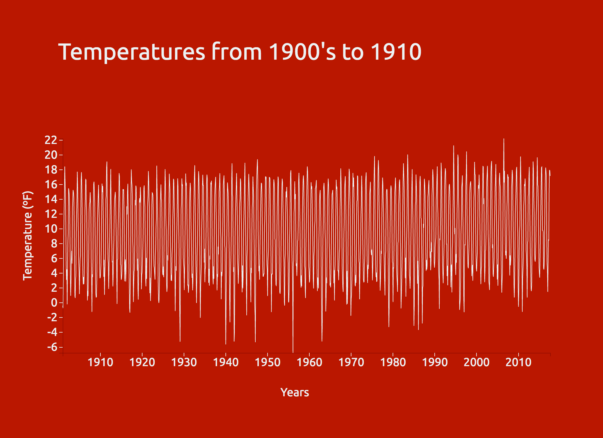

# The First Assessment

We were given 3 types of data files which we could choose from. We then had to place this data into a appropriate graph working with the D3 library.
This turned out to be Mike Bostocks [Bivariate Area Chart](https://bl.ocks.org/mbostock/3884914)



## Steps

These are the steps I've taken to set-up the graph as you can see in the preview.

* Acquire source files from Mike Bostocks [Bivariate Area Chart](https://bl.ocks.org/mbostock/3884914)
* Seperated HTML, JS and CSS and linked properly
* Linked the correct csv instead of tsv
```Javascript
d3.csv("temperature.csv", function (error, data) 
```
* Changed the key values in the js. These were still connected to the old values. This also required a bit of tweaking of the way d3 handles the code. (See next chapter "Fixes" for a more in-dept view of the changes.
*  Updated the D3 library from V3 to V4
* placed comments to make all D3 code understandable
* Styled the graph
* Added the label "year" at the bottom of the graph


## Fixes 

In this part I will show a more indept view of the changes I've made to the code to make it work with my data.

**NOTE:** This is not the complete code. That can be found in the files.

**Old Code**
```Javascript
  //Example code
  var area = d3.svg.area()
      .x(function(d) { return x(d.date); })
      .y0(function(d) { return y(d.low); })
      .y1(function(d) { return y(d.high); });
 
 d3.tsv("data.tsv", function(error, data) {
  if (error) throw error;

  data.forEach(function(d) {
    d.date = parseDate(d.date);
    d.low = +d.low;
    d.high = +d.high;
  });

  x.domain(d3.extent(data, function(d) { return d.date; }));
  y.domain([d3.min(data, function(d) { return d.low; }), d3.max(data, function(d) { return d.high; })]);
      
```
 **Fixed keys:**
 
 ```Javascript //Re:written code
  var
    area  = d3.line()
            .x(function(d) { return x(d.date) })
            .y(function(d) { return y(d.temp) })
            
            
d3.csv("temperature.csv", function (error, data) { //From now on the data in temperature.csv is loaded into the parameter data
    if (error) throw error; //this gives an error if something is wrong

    data.forEach(function (d) { //processes each data field in the parameter data, which we loaded in before with d3.csv etc..
        d.date = parseDate(d.date); //all data under the field .date from the csv is processed into an actual date - this "parseDate" function was defined earlier using "d3.time.format("%Y%m%d").parse;" on line 10.
        d.temp = +d.temp; //processes each field under "temp" in a logical order
    });

    x.domain(d3.extent(data, function (d) {
        return d.date; //returns all date values in data to the .extent function which finds the minimum and maximum values in the array, whereafter the .domain function returns those values to d3 as the range for the x axis - http://www.d3noob.org/2012/12/setting-scales-domains-and-ranges-in.html
    }));

    y.domain(d3.extent(data, function (d) {
        return d.temp; //The same happens here as bove but then for the y axis. This lets d3 know what the scope of data will be, which is then passed onto the scale
    }));
            
```

## Comments

If you download the js file, you will find a lot of comments explaining the code. 

## Sources

These were the source I've used to help me understand the D3 Library

* https://stackoverflow.com/questions/11488194/how-to-use-d3-min-and-d3-max-within-a-d3-json-command
* http://www.d3noob.org/2012/12/setting-scales-domains-and-ranges-in.html
* http://www.recursion.org/d3-for-mere-mortals/
* https://stackoverflow.com/questions/17057809/d3-js-what-is-g-in-appendg-d3-js-code
* https://www.dashingd3js.com/d3js-axes
* https://www.dashingd3js.com/d3js-scales
* https://www.dashingd3js.com/svg-paths-and-d3js
* https://developer.mozilla.org/en-US/docs/Web/SVG/Attribute/dy
* https://developer.mozilla.org/en-US/docs/Web/SVG/Attribute/text-anchor
* https://github.com/d3/d3-selection/blob/master/README.md#selection_datum

## Features
*  [D3 Time](https://github.com/d3/d3/blob/master/API.md#time-formats-d3-time-format)       - https://github.com/d3/d3/blob/master/API.md#time-formats-d3-time-format
*  [D3 Shapes](https://github.com/d3/d3/blob/master/API.md#shapes-d3-shape)     - https://github.com/d3/d3/blob/master/API.md#shapes-d3-shape
*  [D3 Scale](https://github.com/d3/d3/blob/master/API.md#scales-d3-scale)     - https://github.com/d3/d3/blob/master/API.md#scales-d3-scale
*  [D3 Axis](https://github.com/d3/d3/blob/master/API.md#axes-d3-axis)     - https://github.com/d3/d3/blob/master/API.md#axes-d3-axis
*  [D3 Selections](https://github.com/d3/d3/blob/master/API.md#selections-d3-selection)     - https://github.com/d3/d3/blob/master/API.md#selections-d3-selection

## License

MIT - 2017 Marius Vledder


